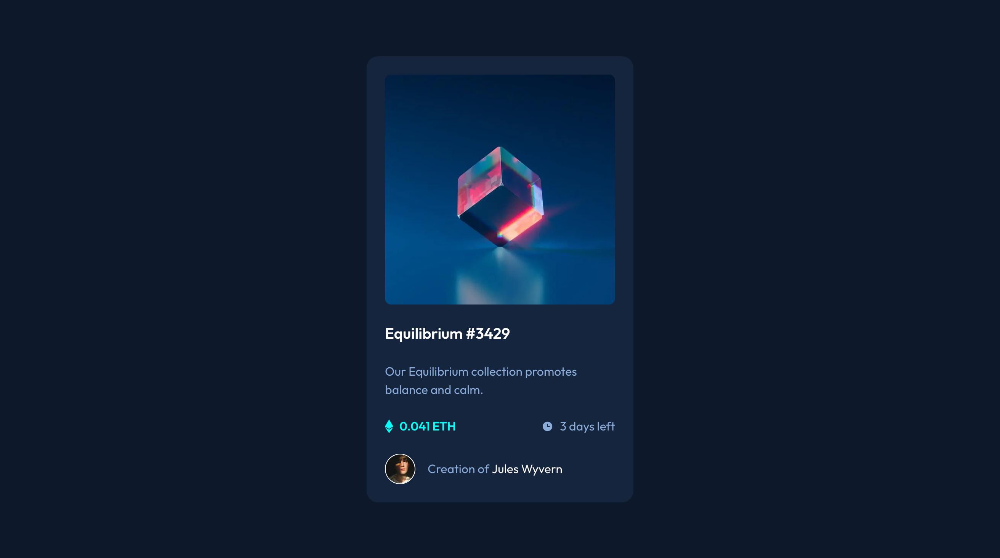

# Frontend Mentor - NFT preview card component solution

This is a solution to the [NFT preview card component challenge on Frontend Mentor](https://www.frontendmentor.io/challenges/nft-preview-card-component-SbdUL_w0U). Frontend Mentor challenges help you improve your coding skills by building realistic projects.

## Table of contents

- [Overview](#overview)
  - [The challenge](#the-challenge)
  - [Screenshot](#screenshot)
  - [Links](#links)
- [My process](#my-process)
  - [Built with](#built-with)
  - [What I learned](#what-i-learned)
  - [Useful resources](#useful-resources)
- [Author](#author)

## Overview

### The challenge

Users should be able to:

- View the optimal layout depending on their device's screen size
- See hover states for interactive elements

### Screenshot

### Links

- [Live Site](https://nft-preview-card-beta-kohl.vercel.app/)

## My process

### Built with

- [Tailwind](https://tailwindcss.com/)
- [React](https://reactjs.org/)
- [Next.js](https://nextjs.org/)

### What I learned

I learned how to use Cursor to write code. I also got to see a nice way of using the relative position and absolution position of two elment to create a nice overlay effect.

### Useful resources

- [Cursor.com](https://cursor.sh/) - This is an amazing article which helped me finally understand XYZ. I'd recommend it to anyone still learning this concept.

## Author

- Website - [Robert Crocker](https://www.robcrock.com)
- Frontend Mentor - [@robcrock](https://www.frontendmentor.io/profile/robcrock)
- Twitter - [@robcrock](https://twitter.com/robcrock)
- LinkedIn - [@robercrocker](https://www.linkedin.com/in/robertcrocker/)
